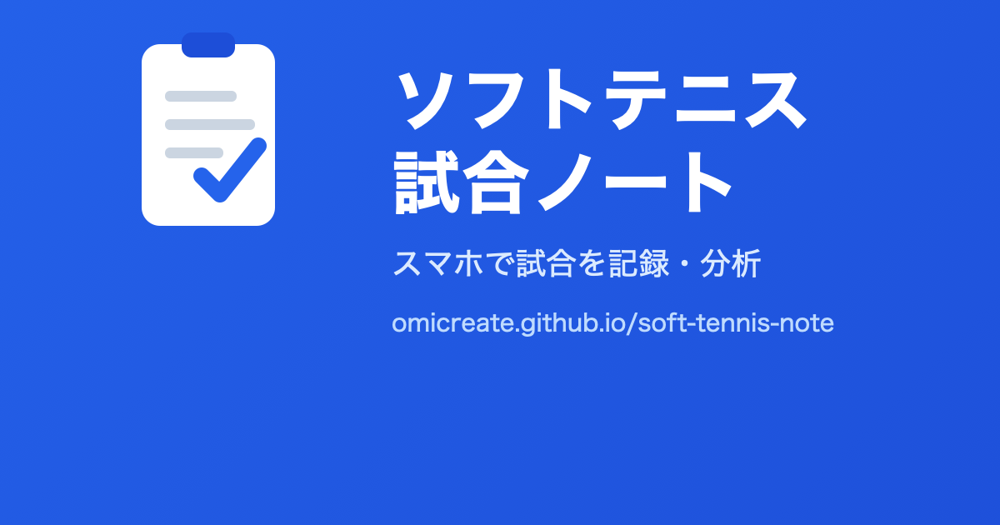
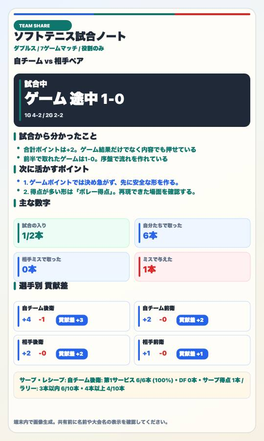

# ソフトテニス試合ノート



スマホで使うことを前提にした、ソフトテニス専用の試合記録・分析アプリです。
試合を外から見る保護者、控え選手、指導者が、ポイントの流れを残し、次に活かす数字とコメントを確認できます。

インストール不要で、スマホのブラウザからそのまま使えます。ホーム画面に追加すると、アプリのように起動できます。

## 公開URL

- 使う: https://omicreate.github.io/soft-tennis-note/
- リポジトリ: https://github.com/omicreate/soft-tennis-note
- 現在の表示バージョン: `v1.0.0`
- 更新履歴: [CHANGELOG.md](CHANGELOG.md)

## 主な機能

- ソフトテニスの試合情報、ゲーム、ポイントの記録
- ダブルス、シングルス、5ゲームマッチ、7ゲームマッチ、9ゲームマッチ、ファイナルゲームのみの記録
- 得点パターン、ミス/失点パターン、序盤失点、ダブルフォールト、レシーブミスなどの分析
- 保存済み試合の確認、開き直し、削除
- サマリー画像の保存と共有
- 管理用CSVと試合データの書き出し、読み込み
- オフライン利用に備えたPWA対応

## 画面と共有イメージ

試合後に、結果、選手別の貢献差、次に活かすポイントを1枚のサマリー画像にまとめ、LINEやSNSで共有できます。



*サンプル試合を読み込んで生成した共有用サマリー画像の例です。*

## 使い方

1. 公開URLをスマホのブラウザで開きます。
2. `メニュー` から新規試合を作成します。
3. 得点ボタンでポイントを記録します。
4. 必要に応じて、サービスサイド、得点になったプレー、ミスになったプレー、半面コート上の到達位置を記録します。
5. `分析` タブで得点率、得点パターン、ミス/失点パターン、コース傾向などを確認します。
6. `履歴` タブで各ポイントの流れを確認します。
7. `サマリー画像を見る` から共有用または保存用の画像を確認します。

初回は `メニュー` の `使い方 / サンプル` からサンプル試合を読み込み、分析と履歴の見え方を確認できます。

## テスト利用時の説明

- 試合を外から見て、保護者、控え選手、指導者が記録する想定です。
- 選手本人が試合中に入力する想定ではありません。
- 本名を使わず、学校名、Aチーム、後衛/前衛などでも記録できます。
- オフライン利用に備えて、試合前に電波の良い場所で一度アプリを開いてください。

## データ/プライバシー

- アカウント登録は不要です。
- 入力データは端末内のブラウザに保存されます。
- 入力データは、開発者、管理者、コーチの端末やサーバーへ送られません。
- 共有する場合はサマリー画像を使い、詳細確認や管理用にはCSVを出力できます。
- 利用者が入力した選手名、学校名、大会名などは、利用者または所属チームの責任で管理してください。
- 詳細は [PRIVACY.md](PRIVACY.md) を確認してください。

## 権利/ライセンス

このリポジトリおよびアプリの著作権は omicreate に帰属します。
許可なく、コード、画面、設計書、画像、文言、分析ロジックの転載、再配布、改変利用、販売、第三者サービスへの組み込みを行うことを禁じます。

- ライセンス: [LICENSE.md](LICENSE.md)
- 利用条件: [TERMS.md](TERMS.md)
- プライバシー: [PRIVACY.md](PRIVACY.md)
- セキュリティ: [SECURITY.md](SECURITY.md)

## スコア仕様

- 初期設定は7ゲームマッチです。
- 5ゲームマッチは3ゲーム先取です。
- 7ゲームマッチは4ゲーム先取です。
- 9ゲームマッチは5ゲーム先取です。
- 通常ゲームは4ポイント先取、2ポイント差です。
- ファイナルゲームは7ポイント先取、2ポイント差です。
- 練習用にファイナルゲームのみの記録もできます。
- ファイナルゲーム中は2ポイントごとにサービスサイドを自動で交替します。
- ファイナルゲーム中のチェンジサイズ確認タイミングを画面に表示します。

## 分析で重視している項目

- ゲーム序盤の失点
- 自チームのダブルフォールト
- 自チームのレシーブミス
- 自チームの得点パターン
- ミス/失点パターン
- ネット、サイドアウト、バックアウト
- 半面コート上の到達位置
- 前半の取得ゲーム数
- 打球面別の失点
- 誰のプレーだったか
- ストローク、ボレー、スマッシュなどショット別のポイント内容

## 用語の参考

画面文言は、公益財団法人日本ソフトテニス連盟の用語ページを参考にしています。

https://www.jsta.or.jp/about_softtennis/words

補足: 審判の正式なコールは「アウト」ですが、アプリでは分析用の分類として「サイドアウト」「バックアウト」を使っています。

## 技術構成

- 実行方式: 静的HTML / CSS / JavaScript
- 主なファイル: `index.html`, `app-config.js`, `app-analysis.js`, `app-storage.js`, `app-rules.js`, `app.js`, `styles.css`
- PWA関連: `manifest.webmanifest`, `sw.js`, `icons/`
- 画像: `assets/og-image.png`, `docs/screenshots/`
- ドキュメント: [docs/00-document-map.md](docs/00-document-map.md)

## 確認方法

```sh
node --check app-config.js
node --check app-analysis.js
node --check app-storage.js
node --check app-rules.js
node --check app.js
node --check sw.js
node tests/analysis-counts.test.js
node tests/match-flow.test.js
node tests/responsive-static.test.js
npm run test:e2e
```

Playwrightを使う場合は、初回のみ以下を実行します。

```sh
npm install
npx playwright install chromium
```

## 開発ドキュメント

後から仕様を見返す場合は、まず [docs/00-document-map.md](docs/00-document-map.md) を確認してください。

要件定義、基本設計、詳細設計、テスト設計、テスト結果をMarkdownで分けて管理しています。
